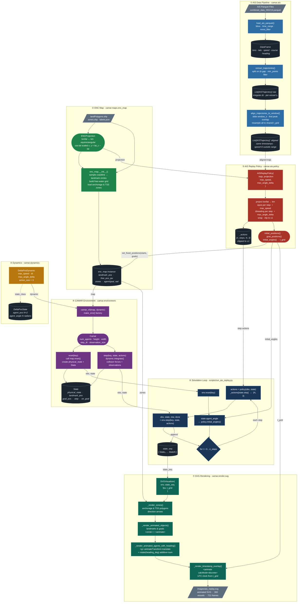

# CAMAR Maritime Simulator — Data Flow

```mermaid
flowchart TD
    %% =====================================================================
    %% ① AIS DATA PIPELINE
    %% =====================================================================
    subgraph AIS["① AIS Data Pipeline  ·  camar.ais"]
        direction TB
        A1[/"AIS Parquet Files\ncombined_data_260219.parquet"/]:::file
        A2["load_ais_parquet()\nbbox · time_range · mmsi_filter"]:::data
        A3[("DataFrame\nlons · lats · speed · course · heading")]:::store
        A4["extract_trajectories()\nsplit on Δt gap · min_points filter"]:::data
        A5[("List[AISTrajectory]  raw\nirregular Δt · per-vessel t₀")]:::store
        A6["align_trajectories_to_window()\nslide window_s · find peak overlap\nresample all to shared t_grid"]:::data
        A7[("List[AISTrajectory]  aligned\nsame timestamps · speed=0 outside range")]:::store

        A1 --> A2 --> A3 --> A4 --> A5 --> A6 --> A7
    end

    %% =====================================================================
    %% ② ENC SHAPEFILES
    %% =====================================================================
    subgraph ENC["② ENC Map  ·  camar.maps.enc_map"]
        direction TB
        E1[/"landPolygons.shp\nzones.shp  ·  labels.json"/]:::file
        E2(["ENCProjection\nlon/lat ↔ km  equirectangular\ncos-lat scaled x, y = lat_c − lat"]):::enc
        E3["enc_map.__init__()\nsample coastline → landmark circles\nbuild free-water grid\nload anchorage & TSS zones"]:::enc
        E4[("enc_map instance\nlandmark_pos  ·  free_pos_jax\nzones  ·  agent/goal_rad")]:::store

        E1 --> E2
        E1 --> E3
        E2 --> E3
        E3 --> E4
    end

    %% =====================================================================
    %% ③ DYNAMICS
    %% =====================================================================
    subgraph DYN["③ Dynamics  ·  camar.dynamics"]
        direction TB
        D1["DeltaPosDynamic\nmax_speed · dt · max_angle_delta\naction_size = 3"]:::dyn
        D2[("DeltaPosState\nagent_pos  N×2\nagent_angle  N  radians")]:::store
        D1 -. "state_class" .-> D2
    end

    %% =====================================================================
    %% ④ CAMAR ENVIRONMENT
    %% =====================================================================
    subgraph ENV["④ CAMAR Environment  ·  camar.environment"]
        direction TB
        V1["camar_v0(map, dynamic)\nmake_env() factory"]:::env
        V2(["Camar\nnum_agents · height · width\nstep_dt · observation_size"]):::env
        V3["reset(key)\ncall map.reset()\ncreate physical_state + State"]:::env
        V4["step(key, state, actions)\ndynamic.integrate()\ncollision forces + observations"]:::env
        V5[("State\nphysical_state  ·  landmark_pos\ngoal_pos  ·  step  ·  on_goal")]:::store

        V1 --> V2
        V2 --> V3
        V2 --> V4
        V3 --> V5
        V4 --> V5
    end

    %% =====================================================================
    %% ⑤ AIS REPLAY POLICY
    %% =====================================================================
    subgraph POL["⑤ AIS Replay Policy  ·  camar.ais.policy"]
        direction TB
        P1["AISReplayPolicy(\n  trajs, projection\n  max_speed, max_angle_delta\n)"]:::policy
        P2["project lon/lat → km\nΔpos per step  ÷ max_speed\nΔheading per step  ÷ max_angle_delta\nwrap · clip to ±1"]:::policy
        P3[("_actions\n(n_steps, N, 3)\nclipped to ±1")]:::store
        P4(["initial_positions()  ·  goal_positions()\ninitial_angles()  ·  t_grid"]):::policy

        P1 --> P2
        P2 --> P3
        P2 --> P4
    end

    %% =====================================================================
    %% ⑥ SIMULATION LOOP
    %% =====================================================================
    subgraph SIM["⑥ Simulation Loop  ·  scripts/run_ais_replay.py"]
        direction TB
        S1["env.reset(key)"]:::sim
        S2["state.agent_angle\n← policy.initial_angles()"]:::sim
        S3{"for t = 0…n_steps"}:::sim
        S4["actions = policy(obs, state)\n_actions[state.step]  →  (N, 3)"]:::sim
        S5["obs, state, rew, done\n= env.step(key, state, actions)"]:::sim
        S6[("state_seq\n[ State₀  …  StateN ]")]:::store

        S1 --> S2 --> S3
        S3 -- "each step" --> S4 --> S5 --> S3
        S5 -- "append" --> S6
    end

    %% =====================================================================
    %% ⑦ RENDERING
    %% =====================================================================
    subgraph REN["⑦ SVG Rendering  ·  camar.render.svg"]
        direction TB
        R1["SVGVisualizer(\n  env, state_seq\n  fps, t_grid\n)"]:::render
        R2["_render_zones()\nanchorage & TSS polygons\ndirection arrows"]:::render
        R3["_render_animated_objects()\nlandmarks & goals\n&lt;circle&gt; + &lt;animate&gt;"]:::render
        R4["_render_animated_agents_with_heading()\n&lt;g&gt; animateTransform translate\n+ rotate(heading_deg) additive=sum"]:::render
        R5["_render_timestamp_overlay()\n&lt;animate calcMode=discrete&gt;\nUTC clock from t_grid"]:::render
        R6[/"images/ais_replay.svg\nanimated SVG  ·  300 vessels  ·  721 frames"/]:::file

        R1 --> R2 --> R3 --> R4 --> R5 --> R6
    end

    %% =====================================================================
    %% CROSS-SECTION CONNECTIONS
    %% =====================================================================

    %% AIS aligned → Policy
    A7 -- "aligned trajs" --> P1

    %% ENC → Policy (shared projection)
    E2 -- "projection" --> P1

    %% Policy initial pos/goals → map (before env creation)
    P4 -- "set_fixed_positions(starts, goals)" --> E4

    %% enc_map + DeltaPosDynamic → camar_v0
    E4 -- "map" --> V1
    D1 -- "dynamic" --> V1

    %% Env ↔ Simulation Loop
    V3 -- "obs, state" --> S1
    V4 -- "obs, state" --> S5

    %% Policy _actions → Loop
    P3 -- "step actions" --> S4

    %% Policy initial_angles → Loop
    P4 -- "initial_angles" --> S2

    %% state_seq + t_grid + zones → Renderer
    S6 -- "state_seq" --> R1
    P4 -- "t_grid" --> R5
    E4 -- "zones" --> R2

    %% =====================================================================
    %% STYLES
    %% =====================================================================
    classDef file    fill:#5D6D7E,stroke:#BDC3C7,color:#fff
    classDef data    fill:#2E6DA4,stroke:#AED6F1,color:#fff
    classDef store   fill:#1A252F,stroke:#7F8C8D,color:#ECF0F1,font-style:italic
    classDef enc     fill:#1E8449,stroke:#82E0AA,color:#fff
    classDef dyn     fill:#B7770D,stroke:#F9E79F,color:#fff
    classDef env     fill:#6C3483,stroke:#D7BDE2,color:#fff
    classDef policy  fill:#A93226,stroke:#F1948A,color:#fff
    classDef sim     fill:#1A3657,stroke:#85C1E9,color:#fff
    classDef render  fill:#0E6655,stroke:#76D7C4,color:#fff
```
